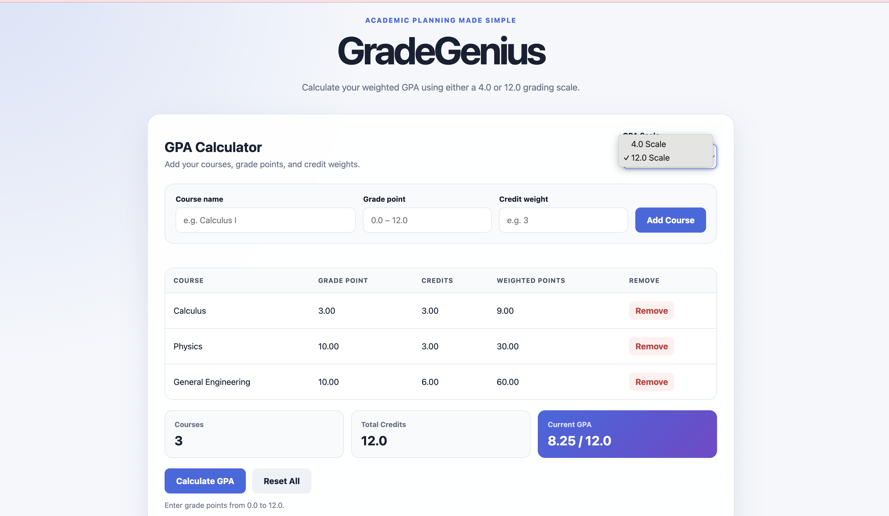

# GradeGenius

GradeGenius is a responsive, browser-based GPA calculator that supports weighted GPA calculations on both 4.0 and 12.0 grading scales.


## Live Demo

[Open GradeGenius](https://gradegenius-gpa-calculator.vercel.app/)


## Preview



## Features

- Choose between a 4.0 and 12.0 GPA scale
- Add courses using grade points and credit weights
- Calculate a weighted GPA automatically
- View weighted points for every course
- Remove individual courses
- Reset all entered courses
- Save courses in the browser using local storage
- Validate grade points and credit weights
- Responsive layout for desktop, tablet, and mobile
- Accessible labels and feedback messages

## How the Calculation Works

GradeGenius uses a credit-weighted average:

```text
Weighted GPA =
sum of (grade point × credit weight)
÷
sum of all credit weights